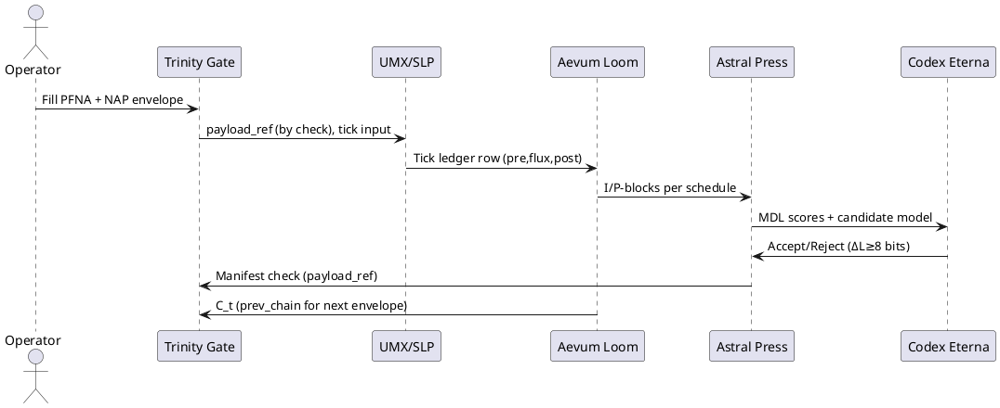

# SPEC-001-AETHER — Full System Build Plan (Medium‑Agnostic)

## Background

**AETHER** is a five‑pillar architecture designed for deterministic computation, reproducible state evolution, and extreme, audit‑ready compression. The pillars interlock as follows (high‑level intent):

- **Trinity Gate / Triune Bridge Protocol (TBP):** The governed I/O membrane and translator. It normalizes inbound/outbound signals, applies PFNA integerization, and moves data across the boundary via NAP envelopes. Gate enforces ordering, idempotence, and approval flows so downstream engines see clean, deterministic inputs.

- **Universal Matrix (UMX):** The integer substrate for state. It represents system state as conservative integer fields on a fixed topology and advances them in ticks via Synaptic Ley Protocol (SLP), guaranteeing conservation, causality bounds, and bit‑for‑bit determinism. UMX exposes tick ledgers, p‑deltas, and optional I‑block snapshots.

- **Aevum Loom:** The time‑axis recorder and replay engine. Loom packages full checkpoints (I‑blocks via Press) and per‑tick residual progress (P‑blocks), with hash‑chaining and optional Merkle roots for tamper evidence. Given the same engine, inputs, math profile, and schedule, Loom guarantees identical replays.

- **Astral Press (APP):** The compression pillar. Press encodes any artefact as **model (rules) + residuals**, producing deterministic **.apx** capsules. Default behavior is exact round‑trip; ε‑bounded modes and symbolic‑only modes are policy‑gated. Press also separates **P_state** (minimal replay snapshot) from **P_cite** (hashed proofs of large externals).

- **Codex Eterna (CE):** The self‑learning libraries layer. CE proposes and governs structural changes (spawn/merge/basis updates) only when total description length drops while fidelity stays within bounds, writing these changes to a hash‑chained structural ledger. Determinism, reversibility, and drift governance are hard barriers.

**System intent (medium‑agnostic):**
- Run identically on offline JS (reference), server/edge, or air‑gapped environments by fixing integer math, tick ordering, container schemas, and envelope formats.
- Capture every computational episode as a chain of NAP envelopes, UMX tick ledgers, and Loom checkpoints; compress artefacts with Press into verifiable APX capsules; and regulate structural evolution via CE.
- Make auditability first‑class: cryptographic hashes at every layer, deterministic rebuild from first principles, and policy cards for fidelity/epsilon and governance.

**Assumptions (proposed until you revise):**
1) Primary reference build will target an offline JS runtime (for operator UX and golden‑fixture parity), with a Linux CLI build for CI and a path to containerized services. 2) Data domains include timeseries, grids/fields, and logs; fidelity defaults to lossless with ε‑bounded options for non‑critical dims. 3) Deployment security requires no external network calls by default, envelope signing optional per environment.


## Requirements

**Context for V0:** Paper‑first, pure‑math execution. Every algorithm must be runnable by hand with deterministic steps and unambiguous forms. Later digital builds must reproduce *exactly* what the paper process would yield.

### MoSCoW

**Must have**
- **Deterministic integer arithmetic only** across all pillars; no floats, no randomness; fixed iteration orders and tie‑breakers documented per routine (edge order, envelope order, ledger order).
- **NAP envelope ledger on paper** using a pre‑printed form with the canonical required fields: `v, tick, gid, nid, layer, mode, payload_ref, seq, prev_chain, sig` and sorted‑key canonicalization rules captured as prose. Include a worksheet for computing a check‑chain (mod prime) and an appendix for SHA‑256 (optional) and a fallback checksum (mod‑97) for intermediate checks. *No raw state inside the envelope; payloads are referenced by hash/check only.*
- **UMX tick workbook** defining a small, fixed topology (grid or explicit adjacency list), with the SLP per‑edge flux rule, causality radius `c`, conservation checks, and a tick ledger template that records pre‑state, per‑edge flux, post‑state, and Σ invariants per tick.
- **Loom I/P‑block logbooks**: I‑block (full checkpoint) sheets and P‑block (residual) sheets with chain fields; schedule policy (e.g., I‑block every `W` ticks) and rollback window noted; cross‑referenced in the U‑ledger.
- **Astral Press paper capsule** (**APX bundle**): a stapled packet representing `.apx` containing (1) a **Manifest cover sheet** (name/size/check/timestamp, layer list, Press version), (2) **Model (SimA) worksheets** with explicit parameters and MDL bit‑length accounting, and (3) **Residual (SimB) tables**. Enforce **P_state (lossless replay core)** vs **P_cite (external proofs/checks)** separation.
- **Codex Eterna MDL gate**: a hand‑runnable acceptance test that only permits library updates (spawn/merge/basis change) when total description length decreases while fidelity constraints are met. Each proposal has a **PROPOSE → REVIEW → COMMIT** trail with bit‑accounting and veto policy.
- **Trinity Gate forms**: PFNA integerization worksheet (units/normalization → integers), scene‑frame worksheet (scene bytes check, payload_ref), and ingress/egress checklists ensuring idempotence and ordering.
- **Versioning & provenance** across all sheets: spec version, profile, operator initials, and cross‑checks linking Gate→Loom→Press→UMX entries per tick.

**Should have**
- **Scale bounds for paper V0**: up to 10 nodes / 16 edges / 64 ticks (or one 8×8 field with `D★=4`, `c=1`) with k/SC constants fixed in the profile card.
- **Operator runbook** with golden fixtures and expected ledgers enabling independent verification/replay by another operator.
- **Witness signatures** in lieu of crypto signatures for paper environments (actual signing reserved for digital builds), while still preserving the `sig` field semantics in the ledger.

**Could have**
- **Error‑checking aids**: mod‑97 or base‑10 cross‑checks per row; colored tabs to mark I‑blocks vs P‑blocks; perforated mini‑cards for NAP sequencers.
- **Paper “encryption” seal**: tamper‑evident stickers enclosing APX bundles (does not replace digital encryption in later builds).

**Won’t have (V0)**
- Automated encryption/HSMs, distributed sharding, high‑throughput queues/back‑pressure controls, or non‑deterministic optimizations. Those are deferred to digital V1 while keeping the same math and forms.

## Method

### 0) Canonical Math Profile (CMP‑0)
- **Domain:** All values are integers (ℤ). Bit‑strings appear only as *notations* on paper; arithmetic reduces to ℤ.
- **Rounding & ties:** `floor()` is the only rounding operator; ties (e.g., equal priority edges) break by lexicographic order of `(edge_id, i, j)`.
- **Ordering:** All procedures enumerate sets in sorted order by their IDs; every table form prints the exact order to use.
- **Check‑chain modulus:** Choose a prime `M = 1,000,000,007` for hand‑friendly modular checks; all per‑tick chain updates compute modulo `M` (see Loom below).

### 1) Paper Artefacts & Serialization
- **NAP Envelope (paper form)**
  - Fields (sorted by key): `v, tick, gid, nid, layer∈{INGRESS,EGRESS,CTRL,DATA}, mode∈{I,P}, payload_ref, seq, prev_chain, sig`.
  - **Canonical text form:** each line `key: value`; no spaces around colon; keys strictly ascending; empty values forbidden.
  - **payload_ref:** a decimal check value from the APX Manifest (`manifest_check`), not raw state.
- **APX Bundle (paper)**
  - A stapled packet: **Manifest** → **Model worksheets (SimA)** → **Residual tables (SimB)** → **Audit notes**.
  - **P_state vs P_cite:** P_state contains only what is required to replay; P_cite lists external artefacts by check value.

### 2) Trinity Gate (PFNA) — Hand Algorithm
Let `x` be a physical quantity with unit U.
1. Choose scale `Δ` (unit per integer) and origin `O` (unit), both integers in unit U.
2. **Integerization:** `n = floor((x − O)/Δ)`.
3. **Bounds:** If a policy range `[n_min, n_max]` exists, clamp `n` into it and record any clamp event in the Gate form.
4. **Scene & Payload:** compute `scene_check` (e.g., sum of bytes mod `M`) and write `payload_ref := manifest_check` from the APX bundle of the scene’s data.

### 3) Universal Matrix (UMX/SLP) — Hand Algorithm
- **Topology:** Nodes `V = {1..N}`, Edges `E ⊆ V×V` undirected or directed per profile; capacity `cap_e ≥ 0`; coupling `k_e ≥ 0`; scale `SC ≥ 1`.
- **State:** `u(t) ∈ ℤ^N`.
- **Per‑edge flux (for undirected edge e=(i,j) with i<j):**
  - `du = u_i(t) − u_j(t)`
  - `raw = floor(k_e * |du| / SC)`
  - `f_e = sgn(du) * min(raw, cap_e, |du|)`
- **Node update:**
  - For node i, `net_i = Σ_{e=(i,*)} (−f_e) + Σ_{e=(*,i)} ( +f_e )`
  - `u_i(t+1) = u_i(t) + net_i`
- **Invariants:** Σᵢ u_i(t+1) = Σᵢ u_i(t). Capacities and causal radius `c` (if used) restrict non‑zero flux to local edges.
- **Tick Ledger (paper row):** `(tick, pre_u[1..N], list⟨e_id, du, f_e⟩ in ID order, post_u[1..N], Σ_check)`.

### 4) Aevum Loom — Hand Algorithm
- **Schedule:** Every tick produces a P‑block row; every `W` ticks produce an I‑block sheet.
- **Chain update (hand‑friendly):**
  - Let `s_t = Σ ( small_primes[i] * post_u[i] )` with `small_primes = [2,3,5,7,11,...]` up to N.
  - `C_t = (17 * C_{t−1} + 23 * s_t + seq) mod M` with `C_0` from the profile card.
  - Record `C_t` in the ledger and copy into the next NAP `prev_chain`.
- **I‑block content:** full `post_u`, topology, `k_e`, `cap_e`, `SC`, `W`, `C_t`.
- **P‑block content:** `tick, list⟨e_id, f_e⟩, C_t`.

### 5) Astral Press (APP) — Hand Compression & MDL
- **Candidate schemes (SimA)** for integer sequences (rows or vectors):
  1. **ID** (identity): literal table; code length = Σ ceil(log₂(|x|+1))+overheads.
  2. **ΔR** (delta + run‑length on zeros): encode `d_k = x_k − x_{k−1}` then RLE zeros.
  3. **GR(p)** (Golomb–Rice with parameter `p∈{0..4}`): encode non‑negative integers `y` by quotient `q = ⌊y / 2^p⌋` (unary) and remainder `r = y mod 2^p` (fixed `p` bits). Use a signed‑to‑unsigned map `S(z) = {0,1,−1,2,−2,...}`.
- **Residuals (SimB):** whatever is not explained by SimA; store as integer tables.
- **MDL score:** `L_total = L_model + L_residual + L_headers`; pick scheme with minimal `L_total`.
- **Paper tables:** provide per‑row bit‑length tallies; a pre‑printed table for `ceil(log₂ n)` up to needed `n`.

### 6) Codex Eterna (CE) — Hand Governance
- **Allowed updates (V0):**
  - Add a new scheme parameter (e.g., change `p`).
  - Switch scheme for a stream.
  - Adjust `k_e`/`cap_e`/`SC` (with conservation proof retained).
- **Gate rule:** Accept only if `ΔL = L_old − L_new ≥ 8` bits and fidelity constraints (e.g., exact replay of `u`) hold.
- **Paper trail:** `PROPOSE` sheet (hypothesis + predicted bits) → `REVIEW` sheet (independent recompute) → `COMMIT` sheet (profile update + chain bump).

### 7) Operator Flow (PlantUML)


### 8) Components (PlantUML)
```plantuml
@startuml
package AETHER {
  [Trinity Gate
(PFNA, NAP)]
  [UMX/SLP
(Integer state, flux)]
  [Aevum Loom
(I/P-blocks, chain)]
  [Astral Press
(Model+Residual, MDL)]
  [Codex Eterna
(Governance)]
}
[Trinity Gate
(PFNA, NAP)] --> [UMX/SLP
(Integer state, flux)]
[UMX/SLP
(Integer state, flux)] --> [Aevum Loom
(I/P-blocks, chain)]
[Aevum Loom
(I/P-blocks, chain)] --> [Astral Press
(Model+Residual, MDL)]
[Astral Press
(Model+Residual, MDL)] --> [Trinity Gate
(PFNA, NAP)] : manifest_check
[Astral Press
(Model+Residual, MDL)] --> [Codex Eterna
(Governance)]
@enduml
```

### 9) Default Profile Card (V0‑paper)
- **Topology:** 10 nodes, ≤16 edges (undirected), `c=1` causal radius.
- **Constants:** `SC=32`, `k_e∈{0,1,2}`, `cap_e ∈ {∞ or 8}`.
- **Loom:** `W=8` ticks per I‑block, `M=1,000,000,007`, `C_0=1234567`.
- **Press:** Schemes allowed {ID, ΔR, GR(p ≤ 4)}; pick min‑MDL per stream.
- **CE threshold:** `ΔL ≥ 8` bits.


## Implementation

### I. Paper Kit V0 (what to print and how to assemble)
**Templates (single‑sided, A4/Letter):**
- **A1 — NAP Envelope Form** (v,tick,gid,nid,layer,mode,payload_ref,seq,prev_chain,sig; canonical key order, no blanks).
- **A2 — UMX Tick Ledger** (tick, pre_u[1..N], ordered edge table ⟨e_id,i,j,du,raw,f_e⟩, post_u[1..N], Σ_check).
- **A3 — Loom P‑Block** (tick, edge flux summary, s_t, C_t, seq).
- **A4 — Loom I‑Block** (full post_u, topology, params, C_t snapshot, window W).
- **A5 — APX Manifest** (name, layer list, manifest_check, profile, streams, sizes, scheme hash, notes).
- **A6 — APX SimA Model Sheet** (scheme∈{ID,ΔR,GR(p)}, parameters, formulae, L_model tally).
- **A7 — APX Residual Table (SimB)** (stream id, index, values, L_residual tally).
- **A8 — MDL Tally** (L_model + L_residual + headers → L_total; compare candidates; pick argmin).
- **A9 — CE PROPOSE** (change, rationale, predicted ΔL, constraint proof).
- **A10 — CE REVIEW/COMMIT** (independent recompute, decision, profile bump, chain bump).
- **A11 — Profile Card (CMP‑0)** (constants, M, W, C_0, allowed schemes, ΔL threshold).
- **A12 — Topology Card** (N, edge list with IDs, capacities cap_e, couplings k_e, SC, c).
- **A13 — PFNA Integerization Worksheet** (units → integers: Δ,O, clamps, incidents).
- **A14 — Scene/Frame & Payload Ref** (scene_check, cited APX manifest_check, notes).

**Lookup appendices (bound booklet):**
- **P1 — Small primes** (first 64 primes) and **P2 — ceil(log₂ n)** table (n up to 2^20).
- **P3 — Golomb–Rice examples** for p∈{0..4} (signed mapping S(z)).
- **P4 — Mod M arithmetic** worked steps with M=1,000,000,007.

**Assembly:**
- One **Binder** per run: Section 0 (Profile/Topology), Section 1 (Gate/Envelopes), Section 2 (UMX Ledger), Section 3 (Loom I/P), Section 4 (APX capsules), Section 5 (CE Governance).
- Each **APX capsule** is stapled: Manifest → SimA → SimB → Audit notes, with a tamper sticker.

### II. Canonical Setup
1) Fill **A11 Profile** with CMP‑0 defaults (Topology≤10 nodes; SC=32; k_e∈{0,1,2}; cap_e∈{∞,8}; Loom W=8; M=1,000,000,007; C_0=1234567; Press schemes {ID,ΔR,GR(p≤4)}; CE ΔL≥8).
2) Define **A12 Topology** (IDs, k_e, cap_e, SC, c=1). Sign by Operator and Witness.

### III. Golden Fixtures (for verification & training)
- **GF‑01 (Graph)**
  - N=6; E={ (1,2),(2,3),(3,4),(4,5),(5,6),(6,1),(1,4),(2,5) }; ID edges in lexicographic order.
  - Params: SC=32; k_e=1 for ring edges, 2 for chords; cap_e=∞; W=8; u(0)=[3,1,0,0,0,0].
  - Deliverables: filled A1–A4 for ticks 1..8, **expected C_t** series for t=1..8; one APX capsule for the 8‑tick ledger (ID vs ΔR vs GR comparison and chosen argmin).
- **GF‑02 (Grid)**
  - 3×3 field mapped to N=9 nodes with 4‑neighbour links; SC=32; k_e=1; cap_e=8; W=8; u(0) a single impulse at center.
  - Deliverables: same as GF‑01.

*(Contractors: prepare both fixtures; we’ll designate one as the canonical exam for acceptance.)*

### IV. Operator Runbook (per tick)
1) **Gate (A1):** Write envelope for tick t with `seq=t`, `prev_chain=C_{t−1}`; compute/record `payload_ref` from current APX manifest.
2) **UMX (A2):**
   - Copy `pre_u`; enumerate edges in ID order; compute `du`, `raw=floor(k_e*|du|/SC)`, `f_e=sgn(du)*min(raw,cap_e,|du|)`; sum `net_i`; write `post_u`.
   - Verify Σᵢ pre_u = Σᵢ post_u.
3) **Loom (A3/A4):**
   - Compute `s_t = Σ primes[i]*post_u[i]`; update `C_t=(17*C_{t−1}+23*s_t+seq) mod M`.
   - Record P‑block; if `t mod W == 0`, emit I‑block and staple a new APX capsule for the last window.
4) **Press (A5–A8):** For each stream (e.g., flux list, post_u deltas), evaluate ID, ΔR, GR(p≤4); compute MDL; pick argmin; update Manifest.
5) **CE (A9–A10, optional):** If a change reduces total bits by ≥8 without violating replay fidelity, submit PROPOSE; independent REVIEW recomputes; on accept, bump profile and chain.

### V. Quality Control
- **Double‑entry**: second operator recomputes `f_e`, `post_u`, and `C_t` on fresh sheets; discrepancies flagged.
- **Spot checks**: recompute two random edges per tick; re‑sum Σ.
- **Witness signatures**: at every **I‑block** (minimum) or every tick (strict mode).

### VI. Packaging & Archival
- Each 8‑tick window becomes a **packet**: I‑block sheet + P‑blocks + UMX rows + Gate envelopes + APX capsule.
- Label spine with run id, t₀–t₈, `C_t` at boundary, operator initials, and profile version.

### VII. Digital Parity (for V1 later)
- Scan templates as **canonical PDFs**; serialize each sheet row to a deterministic text form (same key order); hash to produce the same chain `C_t` and `manifest_check`.
- Implement reference code that mirrors the hand procedures *exactly* (integer only, same order, same rounding and tie‑breakers).


## Milestones

**M0 — Scope Lock (Done)**  Paper‑first V0; GF‑01 as acceptance exam; Witness signatures at I‑blocks.

**M1 — Templates & Appendices (Week 1)**  Finalize A1–A14 forms and P1–P4 lookup booklet; export print‑ready PDFs.

**M2 — Golden Fixtures (Week 1)**  Prepare GF‑01 (graph) and GF‑02 (grid) setup sheets; publish answer keys for first 2 ticks as examples.

**M3 — Operator Runbook (Week 1→2)**  Freeze per‑tick checklist; include edge/tie ordering and Σ‑checks; release v1.0.

**M4 — Pilot Run (Week 2)**  Complete GF‑01 ticks 1..8 with primary operator; produce packets (I/P‑blocks, U‑ledger, Gate envelopes, APX capsule) and expected `C_t` series.

**M5 — Independent Replay (Week 2)**  Second operator reproduces GF‑01 from blank sheets; zero discrepancies required.

**M6 — CE Governance Trial (Week 2→3)**  Submit ≥1 change achieving ΔL≥8 bits without altering replay; document PROPOSE→REVIEW→COMMIT trail.

**M7 — Archive & Parity (Week 3)**  Bind, label, and scan canonical packets; produce deterministic text exports; verify chain parity vs scans.

**M8 — Post‑Mortem & v0.1 Bump (Week 3)**  Record issues, adjust forms, publish v0.1 spec and fixtures.

## Gathering Results

**Acceptance Criteria (Pass/Fail):**
- **Deterministic replay:** Independent run reproduces `post_u` and `C_t` for GF‑01 ticks 1..8 exactly.
- **Conservation & causality:** Σᵢ `u` constant every tick; fluxes respect capacities and radius `c`.
- **Envelope integrity:** All NAP fields present; `prev_chain` matches prior `C_t`; no blanks; ordering respected.
- **Press MDL correctness:** For each stream, chosen scheme has minimal `L_total`; reviewer recompute matches bit‑for‑bit.
- **CE governance:** At least one accepted change with `ΔL ≥ 8` bits; replay state unchanged; trail complete.
- **Witnessing:** Signatures present at each I‑block; dates and initials legible.

**Scoring Rubric (100 pts target ≥95):**
- Replay identity 30; Chain equality 15; Σ‑checks 10; Envelope completeness 10; MDL calculation accuracy 15; CE governance 10; Documentation legibility 10.

**Audit Procedure:**
1) Sample ticks {2,4,8}: recompute `f_e`, `post_u`, `s_t`, and `C_t` from forms only.
2) Re‑encode one stream with ID/ΔR/GR(p≤4); confirm `L_total` and choice.
3) Trace one envelope’s `payload_ref` into its APX Manifest; confirm cross‑references.
4) Verify CE trail and profile card bump.

**Artifacts to Retain:**
- Binder with packets (GF‑01 window), scans (PDF), deterministic text exports, and the finalized Profile & Topology cards.

## Need Professional Help in Developing Your Architecture?

Please contact me at [sammuti.com](https://sammuti.com) :)

---
**Appendix — Source Specs (for printing)**
- [Aevum Loom Pillar — Master spec](/mnt/data/Aevum Loom Pillar — Master spec.txt)
- [Astral Press master implementation spec (combined v1)](/mnt/data/astral_press_master_implementation_spec_combined_v1.md)
- [Codex Eterna — Master spec](/mnt/data/Codex Eterna — Master spec.txt)
- [Trinity Gate — Full spec](/mnt/data/trinity gate full spec.txt)
- [UNIVERSAL MATRIX PILLAR (UMX) — Master Implementation Spec v1](/mnt/data/UNIVERSAL_MATRIX_PILLAR_UMX_Master_Implementation_Spec_v1.md)

